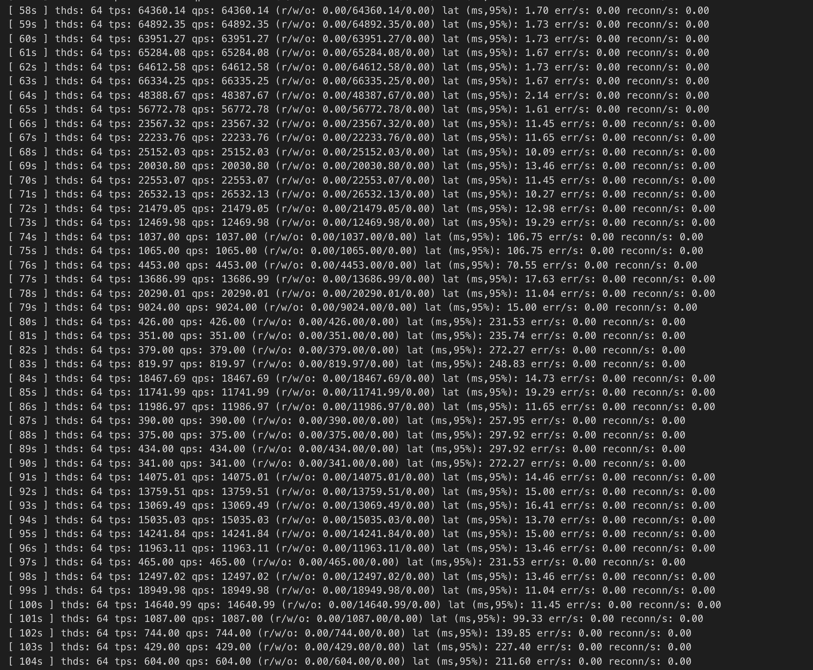
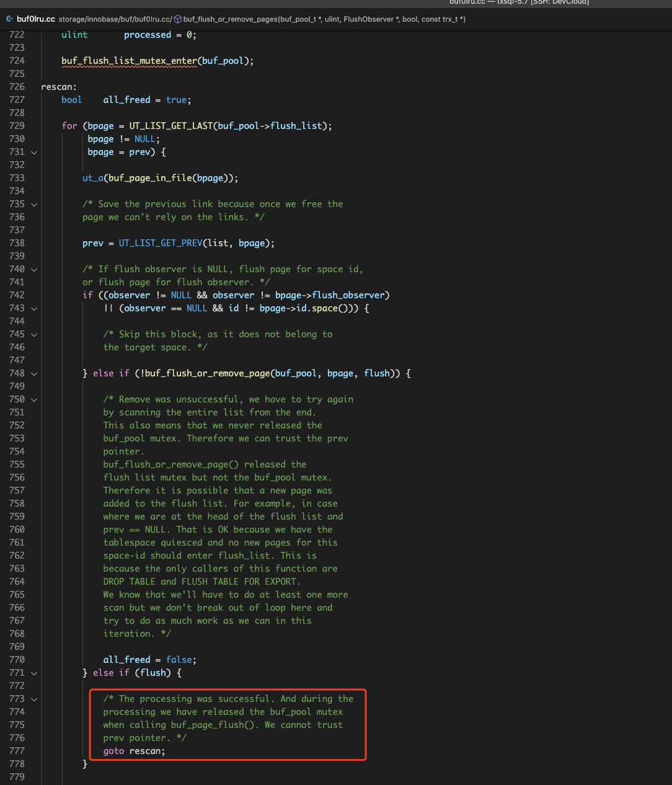
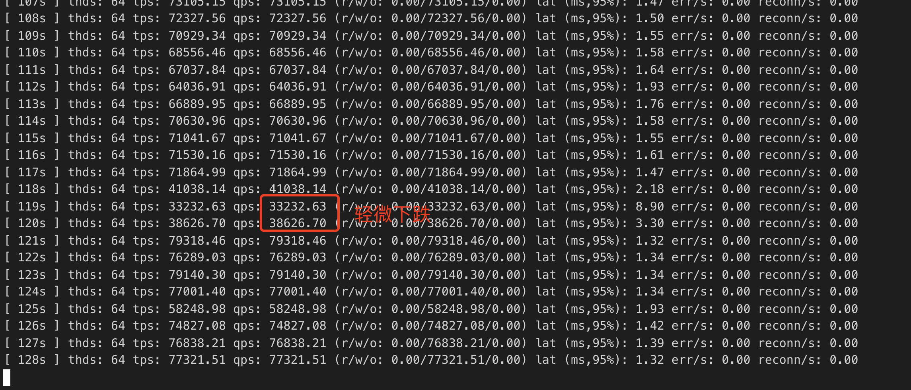
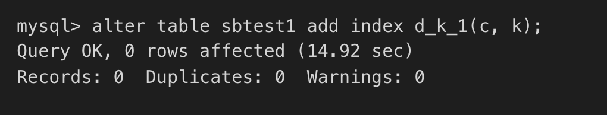

# FAST DDL

##  背景

DDL操作一直是MySQL运维一大痛点，特别是表数据量特别大的情况下，修改表结构，增删索引等等可能会带来很大的延迟。

1. 比如如何在不影响业务的情况下，快速增加一个索引？构建二级索引往往需要读取原表数据，然后进行排序和B树构建，对于大表来说，这个过程可能需要几个小时。

2. 表空间清理、索引创建/删除等等往往需要清理BP，在这个过程中怎么样最小化对业务的影响？

基于这些问题，本文调研了业界关于DDL方面的优化方案，同时也给出了优化TXSQL DDL的方案。

##  业界方案分析

###  ONLINE DDL

在MySQL 5.6之前，执行DDL操作需要锁住整个表，无法进行读写操作，这严重影响了线上业务的可用性，特别是那种需要7x24运行的业务以及表数据量非常大的业务。

为了解决这个问题，官方在5.6中引入了online ddl的功能，同时Percona也提供了一套外围工具pt-online-schema-change，我们逐一介绍下这些工具。

####  官方online-ddl支持

[https://dev.mysql.com/doc/refman/8.0/en/innodb-online-ddl-operations.html](https://dev.mysql.com/doc/refman/8.0/en/innodb-online-ddl-operations.html)

在MySQL5.6中，引入了online DDL的feature。该feature允许大部分DDL语句与MDL语句并发执行，逻辑上它将ddl操作分成了三个阶段，即Initialization，Execution和 Commit Table Definition。

以CREATE INDEX为例：

1. Initialization阶段
     1. 解析DDL语句，决定执行策略，对于CREATE INDEX来说，这里会给目标表上upgradable shared metadata lock，允许读写并发执行。
2. Execution阶段

     1. 在这个阶段，DDL语句需要经历prepare和execution状态。
     2. 对于CREATE INDEX来说，在语句prepare时，需要将表的metadata lock升级成exclusive模式，同时需要等待表上的正在执行的并发事务（DDL操作之前就存在）commit。
     3. 创建row log，用于暂存对表的行修改日志。
     4. 修改表元数据，创建新index的B-tree数据结构。
     5. 降级metadata lock成shared模式，允许事务对table进行并发读写，并将这些并发事务对table的修改记入row log中。
     6. 读取table数据，按照索引列执行外部归并排序，新index填充数据。
     7. 应用row log里的修改日志到新的index中。
     8. 在row log的被应用到只剩下最后一个块时，禁止对表进行写入，同时将row log的日志完全应用到新的index中。

3. Commit Table Definition

     1. 完成元数据更新，释放metadata lock，完成ddl操作。

从这流程中可以看到，metadata exclusive lock锁只拿住很短的时间，大大降低了对前端事务的影响。

同时注意到这里最耗时间的其实是外部归并排序以及新index的数据填充，如果表数据很大，ddl操作本身将会很耗时，因此这是一个可以优化的点。

####  Percona pt-online-schema-change工具

pt工具基本原理如下：

- 对于需要修改schema的table，首先创建一个empty new table，新table包含schema更改
- 拷贝old table的数据到new table
- 同时在old table上建立trigger，当old table有修改时，将修改应用到new table
- 修改应用完毕后，将old table rename成new table

pt的这套流程比较通用，能够支持大部分schema-change场景不影响old table的事务。

但是也存在一些缺点和限制：

- 所有schema change都需要拷贝数据，相比online ddl而言IO代价要高不少
- old table不能存在trigger
- old table需要包含primary key或者unique index
- ...

###  Aurora FAST DDL

AWS aurora的FAST DDL功能其实就是instant ddl，这在TXSQL 5.7里已经得到了实现。

##  TXSQL FAST DDL方案

###  bulk loading时buffer pool清理导致性能抖动和ddl慢

这个性能bug主要问题是flush bulk loading创建出来的btree在某些场景下效率低下。

为了加速bulk loading创建table和索引，官方去掉了redo logging。为了保证crash-safety，在bulk loading创建索引完毕后，需要将这次涉及到的脏页刷到盘上。

这个刷脏的过程是同步的，在一些场景下，会有较大的性能问题。

这个刷脏的过程如下：

1. bulk loading建立起来的索引全部在一个tablespace i中。
2. 给bp flush list上锁。
3. 遍历flush list，从tail 到 head。
4. 对于每个满足flush条件的page（即属于这次bulk loading涉及到的数据页面）
     1. 解除flush list的锁
     2. 执行io
     3. 上flush list的锁
     4. 回到3

注意到这里每次flush成功一个页面，都需要从flush list的tail部分重新开始。主要是因为page flush io过程中，不适合持有flush list的锁。

当页面写入完毕后，重新给flush 上锁后，当前遍历位置可能已经失效了（flush list被刷脏线程修改过了），因此需要重新遍历。

由于每次遍历可能需要遍历整个flush list，复杂度为O(|flush list|)，那么整个同步刷脏可能就需要O(|flush list|^2)的代价了。

当bulk loading所涉及的数据量很小，但是flush list又很长的情况下（即存在很多其他表空间的脏数据），代价很大，bulk loading需要花很长的时间才能完成。

如bug report里所示，500MB表create一个index需要12min的时间。

本地跑下report里的实验，能复现bug中的热点代码。

``` java
+  16.59%  mysqld  mysqld               [.] ut_delay(unsigned long)   
+  12.57%  mysqld  [kernel.kallsyms]    [k] _raw_spin_lock                                                                                                    ▒
-   9.65%  mysqld  mysqld               [.] buf_flush_dirty_pages(buf_pool_t*, unsigned long, FlushObserver*, bool, trx_t const*)                             ▒
     buf_flush_dirty_pages(buf_pool_t*, unsigned long, FlushObserver*, bool, trx_t const*)                                                                    ▒
     buf_LRU_flush_or_remove_pages(unsigned long, buf_remove_t, trx_t const*)                                                                                 ▒
     FlushObserver::flush()                                                                                                                                   ▒
     row_merge_build_indexes(trx_t*, dict_table_t*, dict_table_t*, bool, dict_index_t**, unsigned long const*, unsigned long, TABLE*, dtuple_t const*, unsigne▒
     ha_innobase::inplace_alter_table(TABLE*, Alter_inplace_info*)                                                                                            ▒
     mysql_alter_table(THD*, char const*, char const*, st_ha_create_information*, TABLE_LIST*, Alter_info*)                                                   ▒
     Sql_cmd_alter_table::execute(THD*)                                                                                                                       ▒
     mysql_execute_command(THD*, bool)                                                                                                                        ▒
     mysql_parse(THD*, Parser_state*)                                                                                                                         ▒
     dispatch_command(THD*, COM_DATA const*, enum_server_command)                                                                                             ▒
     do_command(THD*)                                                                                                                                         ▒
     threadpool_process_request(THD*)                                                                                                                         ▒
     worker_main(void*)                                                                                                                                       ▒
     pfs_spawn_thread                                                                                                                                         ▒
     start_thread 
```

BP128GB情况下，开启一个sysbench在150G的数据上执行oltp_update_non_index工作负载。

同时在另外一张500MB大小的表上执行add index操作，发现oltp_update_non_index受到了严重影响:




热点同上，这主要是因为add index的bulk loading涉及到同步刷脏，即碰到了#95582的问题，需要频繁的对flush list进行加解锁，影响其他写频繁事务的TPS，这个抖动持续了几分钟，十分严重.

####  优化思路：bulk loading两阶段清理flush list : 乐观+悲观

这个同步刷脏需要反复扫描flush list的主要原因是因为同步页面刷脏io时需要将flush list mutex和buf pool mutex释放开。

一旦放开了这两个mutex，flush list就可能发生了改变，一些page可能被移出了flush list（被page cleaner清理了），这样导致同步刷脏线程io完毕后，无法确定前一个页面是否还在flush list，只能从头开始扫描。



本方案的优化思路是在悲观扫描前加一轮乐观形式的扫描，该乐观形式扫描过程如下：

遍历flush list时，对于需要同步刷脏的页面bpage, 拿到其prev指针后，通过buf_page_set_sticky函数将prev固定在flush list中，然后再去执行bpage的刷脏i/o。

这样当bpage I/O完成后，重新拿上flush list mutex和buf pool mutex之后，我们可以确保prev指针指向的page还在flush list中，接着从prev开始，继续往前扫描和刷脏。

当然了这个过程中，prev所指页面的io_fix可能不为BUF_IO_NONE，即可能prev本身被pin住了或者在执行io，这个时候是不能对prev执行buf_page_set_dirty的，我们这里的处理方法是跳过这些prev指针，继续往前遍历。

因此这个过程中可能会漏掉一些需要同步刷脏的页面，但是问题不大，我们会用后面原来的悲观扫描来完成这些漏掉页面的刷脏。同时乐观的一轮扫描在大多数情况下能够清理大部分脏页面，这样剩下的脏页留给悲观扫描代价将会相当少。

再跑上面的实验，结果如下图：






优化后，抖动现象明显减少，只有短暂轻微下跌；同时online ddl alter本身时间优化到了15s，48倍的性能提升。