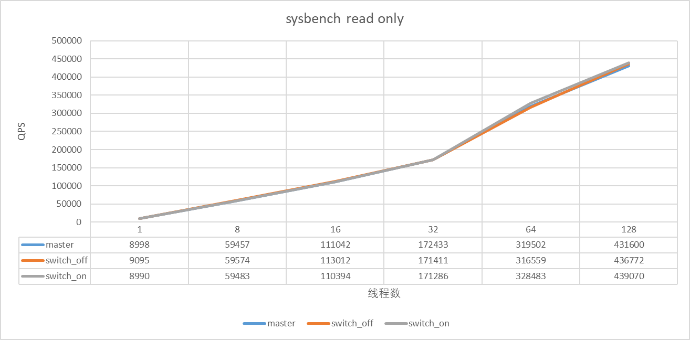
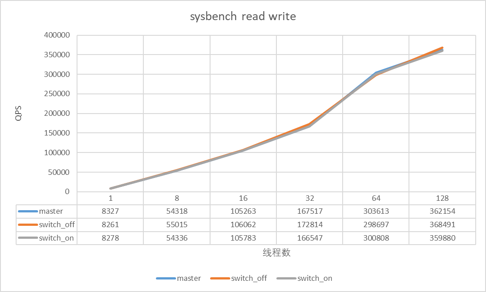

# 闪回查询

## 业界情况调研

### TDSQL

在undo purge的时候将记录存放到另一张历史表。

### 其它

利用触发器，记录插入和删除操作（类似于binlog flashback，insert对应delete，delete对应insert，update将新旧值替换）。

## 方案设计

### 语法设计

``` sql
select * from t1 as of timestamp 'xxxx-xx-xx xx:xx:xx';
select * from t1 as of timestamp 'xxxx-xx-xx xx:xx:xx' where id in (select id from t2 as of timestamp 'xxxx-xx-xx xx:xx:xx');
```

为PT_table_factor_table_ident添加用于记录闪回查询时间的Item成员（实际类型为Item_string），在调用SELECT_LEX::add_table_to_list的时候将字符串时间转换为unix时间戳，在SELECT_LEX::setup_tables中调用引擎层接口获取对应时间点的readview并保存在thd对象中。

### 读取历史数据

#### 概要设计

全局维护历史read view与创建read view的时间，在判断一行记录是否可见的时候使用对应时间点的readview。

#### 保存read view信息

为了减少资源消耗，由一个后台线程每隔一段时间，产生一个该时刻的read view，时间间隔可通过一个变量进行配置（innodb_backquery_trackpoint_create_interval）。产生的read view存放在全局的一个数据结构里面，称为history_views，按照时间顺序排序，innodb_backquery_window用来限制history_views的大小，如果最老的view的时间距离现在的时间超过了window设定的范围，需要清除最老的view。innodb_backquery_history_limit用来限制undo的history长度，当history长度超过了这个值后会忽略window的限制，触发清理最老的read view。

后台线程工作流程：

在同一个线程里需要执行两个任务：

- 调用 ReadView::snapshot创建历史readview，记录时间戳，周期由innodb_backquery_trackpoint_create_interval控制。
- 过期readview清理，周期由innodb_backquery_trackpoint_clean_interval控制。
这里可以设置为两个时间周期是因为如果历史readview的周期很长，可能导致过期readview不能被及时清理。如何在同一个线程实现两种不同周期的任务？
- 基准sleep 1s
- 到了每个任务的执行周期再执行对应的任务

历史readview清理规则：

- innodb_backquery_window用来限制history_views的大小，如果最老的view的时间距离现在的时间超过了window设定的范围，需要清除最老的view。
- innodb_backquery_history_limit用来限制undo的history长度，当history长度超过了这个值后会忽略window的限制，触发清理最老的readview。
- 如果一个历史readview正在被使用则不能清理。

如何判断一个readview是否被使用？

- 对保存的readview添加一个引用计数，如果引用计数大于1则表示正在使用。当查询完成后需要递减引用计数。
- 全局维护一个计数，记录readview被使用的总次数，用于debug或者快速判断是否还有readview在使用。

是否有必要清空ReadView::m_ids（保存了创建readview时活跃事务的id）？

- 如果实例比较繁忙，每一时刻活跃的事务较多，可能这些id占用的内存较多（等待具体测试）

#### 查询历史数据

一个语句如果指定了闪回查询，那么在判断行记录可见性的时候，需要使用指定时间点的readview。修改trx_get_read_view函数，根据当前语句是否是闪回查询来控制使用的readview:

1. 非闪回查询，返回原有的readview
2. 闪回查询，根据table id去thd对象中寻找对应的readview

修改代码中所有需要判断行记录可见性的地方（仅针对记录可见性），由直接使用trx->readview修改为调用trx_get_read_view函数。当闪回查询语句结束的时候需要释放readview，对它的引用计数减1，以便及时清理readview，这个过程在语句执行结束的时候进行，新增一个函数ha_end_backquery，在mysql_execute_command函数的末尾调用。释放readview的过程：

1. 遍历thd所有的用于闪回查询的readview，减少引用计数
2. 清空thd与闪回查询有关的信息

#### create select，insert select支持

原本create select等语句是非一致性读，不会分配readview，考虑到可能有create table ... select ... from tb as of timestamp这种需要，因此需要修改相关逻辑，让create select等语句在指定闪回时使用一致性读的方式。具体的修改是在

ha_innobase::store_lock函数中增加一个判断条件，如果是闪回查询，则使用一致性读。

另外，这些语句都会记录binlog，如果是statement格式的日志，在slave上可能没有开启闪回查询开关，也可能slave不支持闪回查询，这时候slave会因此而中断。为了防止这样的清空，需要添加一个unsafe因素，在判断binlog格式的时候尽可能将闪回查询的日志写出为row格式。具体修改在THD::decide_logging_format中完成。

### 延迟undo清理

#### 概要设计

修改purge线程逻辑，控制历史数据回收。

#### 二级索引purge

二级索引上的记录是没有trx_id，不能直接判断可见性，可能需要回查主索引并遍历历史版本，某些情况下会有O(N^2)的时间复杂度（[相关bug](https://bugs.mysql.com/bug.php?id=84958)），为了减少大量回查带来的性能影响，供闪回查询的数据不提供二级索引，PolarDB这里设计为两次purge（不妨称为两阶段purge）：

- 第一次，从当前活跃的readview中获取最老的readview，只删除二级索引上被delete mark的记录
- 第二次，从闪回查询的history_views中获取最老的read view，删除过期的聚集索引记录

注意：由于二级索引被purge，因此在闪回查询的过程中只能使用聚集索引。

##### undo purge流程修改

原有的purge coordinator线程调用栈：

``` sql
srv_do_purge
  trx_purge
    clone_oldest_view // 获取最老的ReadView
    trx_purge_attach_undo_recs // 获取可以purge的undo记录
    que_fork_scheduler_round_robin // 分发purge任务给worker(如果有worker)
    trx_purge_wait_for_workers_to_complete
    trx_purge_truncate // 从rollback segment中释放不必要的历史数据
      trx_purge_truncate_history
```

我们的目标是第一次purge只清理二级索引的delete mark的记录，这里有两种实现方案：

1. 新增一个purge queue：pre_purge_queue，如果开启了闪回查询，事务提交的时候先将对应的undo添加到新增的pre_purge_queue,purge完二级索引上的delete mark记录后再将对应的TrxUndoRsegs添加到原来的purge_queue，第二次purge从原有的purge_queue中取出事务号最小的TrxUndoRsegs进行purge，注意，此时使用的readview是从闪回查询的history_views中获取的最老的readview。
2. 新增一个purge queue：pre_purge_queue，不论是否开启了闪回查询，在向purge_queue添加内容的时候都需要同等添加到pre_purge_queue中；在purge的过程中，不论是否开启闪回查询都需要遍历pre_purge_queue中的undo日志；开启闪回查询后，第一次purge使用当前最老readview，只删除二级索引记录，第二次purge和原有purge流程保持一致（为了实现动态开关，也会尝试删除二级索引记录，这个过程会根据聚集索引判断二级索引是否可以删除，理论上不存在安全问题）。

第一个方案有一个致命缺陷就是，会将一个回滚段所有的undo信息都push到purge_queue中，极端情况下可能导致OOM。这里采用第二种方案，两个purge queue并行且互不相干。

##### 一阶段purge细节

trx_purge_t的成员记录了purge相关的信息，关键成员：

``` sql
ReadView view; // 控制purge的readview，每次purge开始前调用clone_oldest_view进行赋值
purge_iter_t iter; // 当前进行purge的TrxUndoRsegs的迭代器
trx_rseg_t *rseg;  // 下一个需要被purge的undo log的回滚段
page_no_t page_no;  // 下一个需要被purge的undo log的log header所在页面
ulint offset;  // 下一个需要被purge的undo log的页面偏移
page_no_t hdr_page_no;  // 下一个需要被purge的undo log的undo header所在页面
ulint hdr_offset;  // 下一个需要被purge的undo log的undo header页面偏移
/* ... */
```

rollback segment的内存结构trx_rseg_t也有一些数据记录当前purge的进度

``` sql
// 历史链表中最老未被purge的undo log header所在页面
page_no_t last_page_no;
// 历史链表中最老未被purge的undo log header所在页面偏移
size_t last_offset;
// 历史链表中最老未被purge的undo log的事务号
trx_id_t last_trx_no;
// 历史链表中最老未被purge的undo log是否需要purge（有delete undo）
bool last_del_marks;
```

purge流程：

purge的时候从队列中取出一个TrxUndoRsegs对象（保存了事务使用的所有rollback segment），遍历其中的rollback segment（每一个rollback segment都有成员last_page_no和last_offset来表示该回滚段中最老未被purge的undo日志header所在的页面与偏移），根据last_page_no和last_offset来定位需要purge的undo日志，再遍历undo日志中的每一个undo记录进行purge。

为了支持两阶段purge，需要在trx_purge_t和trx_rseg_t中为back query增加相应的内容来记录第一次purge的进度，这里的处理方式和原生的purge流程相似（代码和原生purge几乎一样），如果关闭了闪回查询，这个过程是只遍历undo记录，不做任何操作。

##### 一阶段purge worker流程

purge worker的第一次purge流程（如果有worker数量大于1，否则coordinator线程自己负责purge）需要做一些改变：

第一次purge流程：

- 获取一批undo日志
- 尝试删除二级索引记录，不删除主索引记录（开关打开）
- 不删除被更新的external存储的内容

第二次purge流程和原生purge流程一样：

- 获取一批undo日志
- 尝试删除二级索引记录
- 删除主索引记录
- 删除被更新的external存储的内容

#### undo truncate流程

purge是删除delete mark的记录，事务产生的undo内容在truncate过程中清理。函数trx_purge_truncate中:

``` cpp
if (purge_sys->limit.trx_no == 0) {
  trx_purge_truncate_history(&purge_sys->iter, &purge_sys->view);
} else {
  trx_purge_truncate_history(&purge_sys->limit, &purge_sys->view);
}
```

可以通过控制trx_purge_truncate_history使用的readview来控制是否truncate undo内容，这里直接使用backquery_history_view_list最老的的readview来延缓undo truncate。

## 使用说明

### 变量说明

<table>
<tr>
<td rowspan="1" colSpan="1" >名称</td>
<td rowspan="1" colSpan="1" >类型</td>
<td rowspan="1" colSpan="1" >有效值</td>
<td rowspan="1" colSpan="1" >默认值</td>
<td rowspan="1" colSpan="1" >说明</td>
</tr>

<tr>
<td rowspan="1" colSpan="1" >innodb_backquery_enable</td>
<td rowspan="1" colSpan="1" >bool</td>
<td rowspan="1" colSpan="1" >ON\|OFF</td>
<td rowspan="1" colSpan="1" >OFF</td>
<td rowspan="1" colSpan="1" >开关</td>
</tr>

<tr>
<td rowspan="1" colSpan="1" >innodb_backquery_window</td>
<td rowspan="1" colSpan="1" >LONG</td>
<td rowspan="1" colSpan="1" >1~2592000</td>
<td rowspan="1" colSpan="1" >86400</td>
<td rowspan="1" colSpan="1" >闪回支持的时间范围，单位：秒</td>
</tr>

<tr>
<td rowspan="1" colSpan="1" >innodb_backquery_history_limit</td>
<td rowspan="1" colSpan="1" >ULONG</td>
<td rowspan="1" colSpan="1" >1~INT_MAX64</td>
<td rowspan="1" colSpan="1" >8000000</td>
<td rowspan="1" colSpan="1" >闪回支持的undo日志历史链表长度，超过这个长度，会忽略innodb_backquery_window，进行purge，直到长度低于设定值</td>
</tr>

<tr>
<td rowspan="1" colSpan="1" >innodb_backquery_trackpoint_create_interval</td>
<td rowspan="1" colSpan="1" >LONG</td>
<td rowspan="1" colSpan="1" >1~86400</td>
<td rowspan="1" colSpan="1" >1</td>
<td rowspan="1" colSpan="1" >闪回查询的时间粒度（创建readview快照的时间间隔），单位：秒</td>
</tr>

<tr>
<td rowspan="1" colSpan="1" >innodb_backquery_trackpoint_clean_interval</td>
<td rowspan="1" colSpan="1" >LONG</td>
<td rowspan="1" colSpan="1" >1~86400</td>
<td rowspan="1" colSpan="1" >1</td>
<td rowspan="1" colSpan="1" >闪回清理readview快照的时间间隔，单位：秒</td>
</tr>
</table>


### 状态变量

<table>
<tr>
<td rowspan="1" colSpan="1" >名称</td>
<td rowspan="1" colSpan="1" >说明</td>
</tr>

<tr>
<td rowspan="1" colSpan="1" >Innodb_backquery_history_views</td>
<td rowspan="1" colSpan="1" >存储在内存中的历史readview个数</td>
</tr>

<tr>
<td rowspan="1" colSpan="1" >Innodb_backquery_up_time</td>
<td rowspan="1" colSpan="1" >最老的readview的创建时间（带时区）</td>
</tr>

<tr>
<td rowspan="1" colSpan="1" >Innodb_backquery_low_time</td>
<td rowspan="1" colSpan="1" >最新的readview的创建时间（带时区）</td>
</tr>
</table>


### 使用示例

``` sql
MySQL [(none)]> set global innodb_backquery_enable=ON;
Query OK, 0 rows affected (0.00 sec)
MySQL [test]> create table t1(id int,c1 int) engine=innodb;
Query OK, 0 rows affected (0.06 sec)

MySQL [test]> insert into t1 values(1,1),(2,2),(3,3),(4,4);
Query OK, 4 rows affected (0.01 sec)
Records: 4  Duplicates: 0  Warnings: 0

MySQL [test]> select now();
+---------------------+
| now()               |
+---------------------+
| 2022-02-17 16:01:01 |
+---------------------+
1 row in set (0.00 sec)

MySQL [test]> delete from t1 where id=4;
Query OK, 1 row affected (0.00 sec)

MySQL [test]> select * from t1;
+------+------+
| id   | c1   |
+------+------+
|    1 |    1 |
|    2 |    2 |
|    3 |    3 |
+------+------+
3 rows in set (0.00 sec)

MySQL [test]> select * from t1 as of timestamp '2022-02-17 16:01:01';
+------+------+
| id   | c1   |
+------+------+
|    1 |    1 |
|    2 |    2 |
|    3 |    3 |
|    4 |    4 |
+------+------+
4 rows in set (0.00 sec)
```

### 其它说明

#### create select

``` sql
create table t2 select * from t1 as of timestamp 'xxx';
```

#### insert select

``` sql
insert into t3 select * from t1 as of timestamp 'xxx';
```

注意：暂不支持prepared statement和stored procedure

## 测试

### 功能测试

数据准备

``` sql
create table t1(id int primary key, c1 varchar(20));
insert into t1 values(1,'aaa'),(2,'bbb'),(3,'ccc'),(4,'ddd'),(5,'eee');

create table t2(id int primary key, c1 varchar(20));
insert into t2 values(1,'adaa'),(2,'bdbb'),(3,'cdcc'),(4,'ddcd'),(5,'eefe');

select now();
2022-02-28 15:01:31
```

#### 测试1

``` sql
update t1 set c1='abcdefg' where id=5;

select * from t1 as of timestamp '2022-02-28 15:01:31';
1 aaa
2 bbb
3 ccc
4 ddd
5 eee
```

符合预期

#### 测试2

``` sql
select t1.c1,t2.id from t1,t2 where t1.id=t2.id;
aaa   1
bbb   2
ccc   3
ddd   4
abcedfg 5
```

符合预期

#### 测试3

``` sql
select t1.c1,t2.id from t1 as of timestamp '2022-02-28 15:01:31',t2 where t1.id=t2.id;
aaa   1
bbb   2
ccc   3
ddd   4
eee   5
```

符合预期

#### 测试4

``` sql
select now();
2022-02-28 15:03:33
select t1.c1,t2.id from t1 as of timestamp '2022-02-28 15:01:31',t2 as of timestamp '2022-02-28 15:03:33' where t1.id=t2.id;
aaa   1
bbb   2
ccc   3
ddd   4
eee   5
```

#### 测试5

``` sql
select * from t2;
1 adaa
2 bdbb
3 cdcc
4 ddcd
5 eefe
select now();
2022-02-28 15:05:14
update t2 set c1= 'newabcd' where id=1;
select now();
2022-02-28 15:05:42
select t1.c1,t2.id,t2.c1 from t1 as of timestamp '2022-02-28 15:01:31',t2 as of timestamp '2022-02-28 15:05:42' where t1.id=t2.id;
aaa 1 newabcd
bbb 2 bdbb
ccc 3 cdcc
ddd 4 ddcd
eee 5 eefe
select t1.c1,t2.id,t2.c1 from t1 as of timestamp '2022-02-28 15:05:42',t2 as of timestamp '2022-02-28 15:05:42' where t1.id=t2.id;
aaa   1 newabcd
bbb   2 bdbb
ccc   3 cdcc
ddd   4 ddcd
abcdefg 5 eefe
```

### 内存占用测试

sysbench read_write 1024并发，测试内存占用。历史链表长度很快就到达了innodb_backquery_history_limit的限制，实际上整个测试过程中保存的views的数量只有几百个，内存占用可以忽略不计。

### 性能测试

机器配置：96核心，700G+内存。测试：bp 100G，100张表，单表100000数据，测试时间10分钟。backquery开关打开后的配置：innodb_backquery_window=3600，其它默认值。

测试结果：

sysbench read-only



sysbench read-write



从结果来看没有明显性能下降，基本保持一致。

### 稳定性测试

sysbench read-write；1024并发；时间：1小时；sysbench运行过程中使用脚本文件随机打开和关闭 innodb_backquery_enable 开关，实例稳定运行，未crash。

## 开关关闭时Undo扫描优化

现有实现方式，在开关关闭后仍然会扫描undo来维持第一次purge的进度的正确性，会带来一些开销。

### 优化方式

开关关闭后不扫描undo，在开关打开时，遍历所有回滚段（这期间需要阻止purge线程运行），将所有回滚段的第一次purge的进度设置为和第二次purge进度一致（可能会有进度回退）。打开开关的过程中可能存在这样的一些情形：

场景1

``` sql
|                             |
|                             |
|                             set backquery on
trx 1 rseg->latch()           |
push queue                    |
trx 1 rseg->unlatch()         |
|                             |
|                             rseg->latch()
|                             rseg->pre_last_page_no=FIL_NULL
|                             rseg->unlatch()
|                             |
```

上面的情况下，trx1 push到queue中的内容是不需要的。

场景2

``` sql
|                                  |
|                                  |
set backquery on                   |
rseg->latch()                      |
rseg->pre_last_page_no=FIL_NULL    |
rseg->unlatch()                    |
|                                  |
|                                 trx 2 rseg->latch()
|                                 push queue
|                                 trx 2 rseg->unlatch()
|                                  |
```

上面的情况下，trx 2 push到queue中的内容是需要的。

由于上面这两种情况的存在，所以pre_queue中的内容是否全部需要是不能判断的，因此我们直接将purge_queue中的内容拷贝到pre_purge_queue中，同时需要拷贝其它表示purge进度的变量。