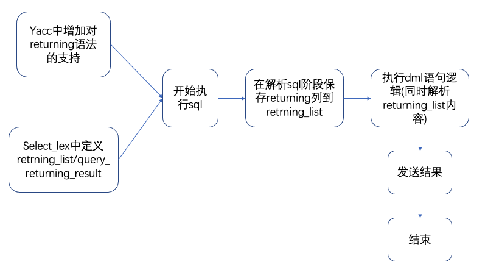

# RETURNING 设计文档

## 问题背景

在某些用户场景下，用户需要在DML操作后返回刚操作的数据行。实现这个需求一般有两种办法：一是在开启事务的后在DML语句后紧跟一条SELECT语句；二是使用触发器等较为复杂的操作实现。前者主要会增加一条SELECT语句的开销，后者则会令SQL的实现变得更加复杂并且不够灵活(需要创建触发器)。因此，RETURNING语法的设计主要针对该场景的优化，通过在DML语句后增加RETURNING关键字可以灵活高效地实现上述的需求。

## 设计思路

本文的设计思路主要参考MariaDB的returning功能实现，具体代码逻辑流程如下(以insert语句为例)：

1. 首先在生成语法分析器定义各种insert语句的同时，在语句的最后增加一个returning关键字，该关键字后面跟的是一个select_item_list，用于表示想要返回的列。
2. select_lex和select_lex_unit在mysql中用于表示解析后的sql，我们在select_lex结构体中定义List<Item>和Query_result成员，分别用于保存和发送returning的结果集。
3. 在真正开始执行insert语句的过程中，会首先在sql解析阶段将returning对应的列解析保存在select_lex的returning_list中。
4. 在正式执行insert语句时，会在执行过程中对returning的列进行解析，并最后在insert结束前通过Query_result发送结果给用户。

下图为简单的流程示意图:




## 功能测试

```INSERT... RETURNING```

``` sql
MySQL [test]> CREATE TABLE `t1` (id1 INT);
Query OK, 0 rows affected (0.04 sec)

MySQL [test]> CREATE TABLE `t2` (id2 INT);
Query OK, 0 rows affected (0.03 sec)

MySQL [test]> INSERT INTO  t2 (id2) values (1);
Query OK, 1 row affected (0.00 sec)

MySQL [test]> INSERT INTO t1 (id1) values (1) returning *, id1 * 2, id1 + 1, id1 * id1 as alias, (select * from t2); 
+------+---------+---------+-------+--------------------+
| id1  | id1 * 2 | id1 + 1 | alias | (select * from t2) |
+------+---------+---------+-------+--------------------+
|    1 |       2 |       2 |     1 |                  1 |
+------+---------+---------+-------+--------------------+
1 row in set (0.01 sec)

MySQL [test]> INSERT INTO t1 (id1) SELECT id2 from t2 returning id1;
+------+
| id1  |
+------+
|    1 |
+------+
1 row in set (0.01 sec)
```

```REPLACE ... RETURNING```

``` sql
MySQL [test]> CREATE TABLE t1(id1 INT PRIMARY KEY, val1 VARCHAR(1));
Query OK, 0 rows affected (0.04 sec)

MySQL [test]> CREATE TABLE t2(id2 INT PRIMARY KEY, val2 VARCHAR(1));
Query OK, 0 rows affected (0.03 sec)

MySQL [test]> INSERT INTO t2 VALUES (1,'a'),(2,'b'),(3,'c');
Query OK, 3 rows affected (0.00 sec)
Records: 3  Duplicates: 0  Warnings: 0

MySQL [test]> REPLACE INTO t1 (id1, val1) VALUES (1, 'a');
Query OK, 1 row affected (0.00 sec)

MySQL [test]> REPLACE INTO t1 (id1, val1) VALUES (1, 'b') RETURNING *;
+-----+------+
| id1 | val1 |
+-----+------+
|   1 | b    |
+-----+------+
1 row in set (0.01 sec)
```

```DELETE ... RETURNING```

``` sql
MySQL [test]> CREATE TABLE t1 (a int, b varchar(32));
Query OK, 0 rows affected (0.04 sec)

MySQL [test]> INSERT INTO t1 VALUES
    ->   (7,'ggggggg'), (1,'a'), (3,'ccc'),
    ->   (4,'dddd'), (1,'A'), (2,'BB'), (4,'DDDD'),
    ->   (5,'EEEEE'), (7,'GGGGGGG'), (2,'bb');
Query OK, 10 rows affected (0.03 sec)
Records: 10  Duplicates: 0  Warnings: 0

MySQL [test]> DELETE FROM t1 WHERE a=2 RETURNING *;
+------+------+
| a    | b    |
+------+------+
|    2 | BB   |
|    2 | bb   |
+------+------+
2 rows in set (0.01 sec)

MySQL [test]> DELETE FROM t1 RETURNING *;
+------+---------+
| a    | b       |
+------+---------+
|    7 | ggggggg |
|    1 | a       |
|    3 | ccc     |
|    4 | dddd    |
|    1 | A       |
|    4 | DDDD    |
|    5 | EEEEE   |
|    7 | GGGGGGG |
+------+---------+
8 rows in set (0.01 sec)
```
